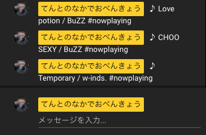

# now-playing-bot-on-youtube-live

Spotify で再生中の曲を定期的に YouTube Live のチャットに書き込む Bot

## Demo



## Prerequisites

- YouTube
  - YouTube Live を行えるアカウントを持っていること

- GCP
  - YouTube Data API v3 が有効になっているプロジェクトが作成済みであること
  - OAuth 同意画面を使用するためのアプリが登録済みであること
  - YouTube Live を行うアカウントのメールアドレスがテストユーザーとして登録済みであること
  - OAuth クライアント ID が作成済みであること

- Spotify
  - Spotify Premium に登録済みであること
  - Spotify のアプリがインストール済みであること 
  - Spotify for Developers でアプリを作成済みであること
  - 上記アプリで Redirect URI が設定済みであること

## Environment

```
% sw_vers
ProductName:	macOS
ProductVersion:	11.2.3
BuildVersion:	20D91

% python --version
Python 3.9.5

% pip --version
pip 21.1.1 from /Users/<USERNAME>/.anyenv/envs/pyenv/versions/3.9.5/lib/python3.9/site-packages/pip (python 3.9)
```

## Setup

```
$ pip install --upgrade google-api-python-client google-auth-httplib2 google-auth-oauthlib
$ pip install spotipy

or

$ pip install -r requirements.txt
```

```
$ export SPOTIPY_USERNAME="<USER_NAME>"
$ export SPOTIPY_CLIENT_ID="<CLIENT_ID>"
$ export SPOTIPY_CLIENT_SECRET="<CLIENT_SECRET>"
$ export SPOTIPY_REDIRECT_URI="<REDIRECT_URL>"
```

## Usage

```
% python main.py 
YouTube Live URL: https://youtu.be/xxxxxxxxxxx
♪ Love potion / BuZZ #nowplaying
♪ CHOO SEXY / BuZZ #nowplaying
♪ Temporary / w-inds. #nowplaying
```
